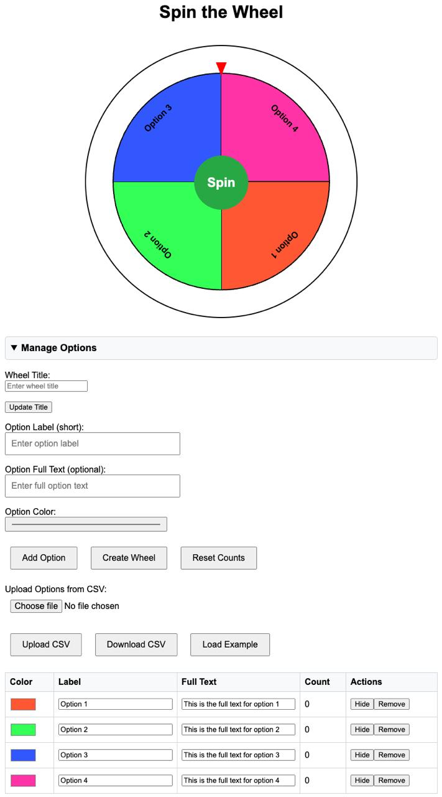

# Spin the Wheel

An interactive, customizable "Spin the Wheel" web application that allows users to create and manage their own wheels with various options. Ideal for games, raffles, decision-making, and more.



## Features

- **Customizable Options**: Add, edit, and remove options directly in the application.
- **In-Place Editing**: Edit option labels, full texts, and colors directly in the options table.
- **Option Counts**: Track how many times each option has been selected.
- **CSV Upload/Download**: Import options from a CSV file or export your current options, including counts.
- **Load Example Options**: Quickly load a set of example options to get started.
- **Reset Counts**: Reset the counts for all options back to zero.
- **Hide/Show Options**: Temporarily hide options from the wheel without deleting them.
- **Random Colors**: Assign random colors to options for a vibrant wheel.
- **Confetti Animation**: Celebrate the selected option with a confetti animation.
- **Tooltip Information**: Hover over wheel segments to see the full text of each option.

## Demo

[Live Demo]([https://your-demo-url.com](https://mightymouse-co-uk.github.io/spin-the-wheel/))

## Getting Started

### Prerequisites

- A modern web browser (Chrome, Firefox, Safari, Edge, etc.)

### Installation

1. **Clone the Repository**

   ```bash
   git clone https://github.com/mightymouse-co-uk/spin-the-wheel.git
   ```

2. **Navigate to the Project Directory**

   ```bash
   cd spin-the-wheel
   ```

3. **Open the Application**

   Open `index.html` in your web browser.

### Alternative: Download ZIP

1. **Download ZIP**

   Download the repository as a ZIP file and extract it to your desired location.

2. **Open the Application**

   Open `index.html` in your web browser.

## Usage

### Adding Options

1. **Enter Option Label**

   - Provide a short label for the option in the **"Option Label (short)"** field.

2. **Enter Option Full Text (Optional)**

   - Provide a full description in the **"Option Full Text"** field.
   - If left blank, it will default to the label.

3. **Select Option Color**

   - Choose a color using the color picker.
   - A random color is selected by default.

4. **Add Option**

   - Click **"Add Option"** to add it to the options table.

### Managing Options

- **Edit Options**

  - Directly edit the **Label**, **Full Text**, or **Color** in the options table.
  - Changes are saved automatically when you click outside the input field.

- **Hide/Show Options**

  - Click the **"Hide"** or **"Show"** button to toggle the visibility of an option on the wheel.

- **Remove Options**

  - Click the **"Remove"** button to delete an option from the list.

- **Reset Counts**

  - Click the **"Reset Counts"** button to reset the selection counts for all options back to zero.

### Creating and Spinning the Wheel

1. **Create Wheel**

   - Click **"Create Wheel"** to generate the wheel with the current visible options.

2. **Spin the Wheel**

   - Click the **"Spin"** button in the center of the wheel to spin it.

3. **View Results**

   - The result popup will display the **full text** of the winning option.
   - The count for the selected option will increment by 1.

4. **Post-Spin Actions**

   - **Hide Option**: Click **"Hide Option"** to hide the selected option from future spins.
   - **Close**: Click **"Close"** to dismiss the result popup.

### Uploading and Downloading Options via CSV

- **Upload Options from CSV**

  1. Click **"Choose File"** under **"Upload Options from CSV"**.
  2. Select your CSV file.
  3. Click **"Upload CSV"** to import the options.
     - Existing options will be replaced.

- **Download Options as CSV**

  - Click the **"Download CSV"** button to save the current options, including counts, to a CSV file.

#### CSV File Format

- **Columns**: Label, Full Text, Color, Count
- **Example CSV Content**:

  ```csv
  Label,Full Text,Color,Count
  "Option 1","This is the full text for option 1","#FF5733",2
  "Option 2","Full text for option 2","#33FF57",5
  "Option 3","Full text for option 3","#3357FF",3
  "Option 4","Full text for option 4","#FF33A5",0
  ```

### Loading Example Options

- Click the **"Load Example"** button to load a set of predefined options.

### Updating the Wheel Title

- Enter a new title in the **"Wheel Title"** field.
- Click **"Update Title"** to apply the new title.

## Contributing

Contributions are welcome! Please follow these steps:

1. **Fork the Repository**

   Click the **"Fork"** button at the top-right corner of this page to create a copy of the repository under your GitHub account.

2. **Clone Your Fork**

   ```bash
   git clone https://github.com/yourusername/spin-the-wheel.git
   ```

3. **Create a New Branch**

   ```bash
   git checkout -b feature/your-feature-name
   ```

4. **Commit Your Changes**

   ```bash
   git commit -am 'Add new feature'
   ```

5. **Push to the Branch**

   ```bash
   git push origin feature/your-feature-name
   ```

6. **Submit a Pull Request**

   Open a pull request to the main repository's `main` branch.

## License

This project is licensed under the MIT License - see the [LICENSE](LICENSE) file for details.

## Acknowledgments

- Created by ChatGPT o1-preview with lots of prompts and testing from Nick.

## Contact

For questions or suggestions, please open an issue.
